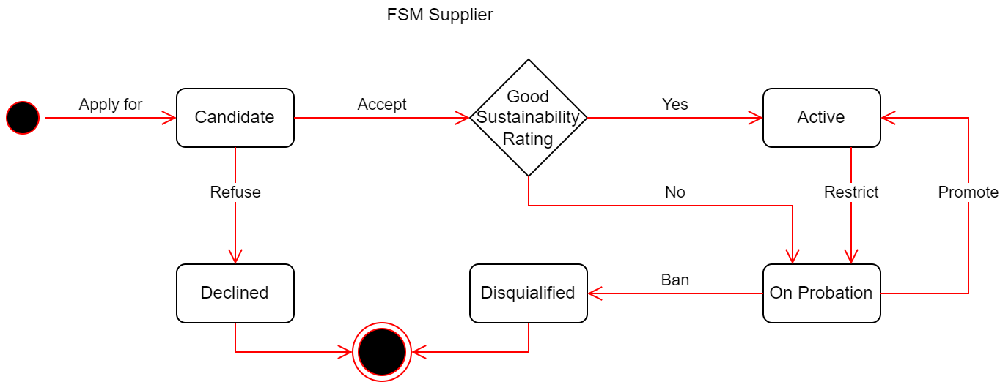

# Technical Test — Full-Stack Engineer

## Inditex Supplier Management

Inditex manages a large network of suppliers. This technical test evaluates your ability to design and implement a **full-stack** solution covering both the backend business logic and the frontend user interface.

---

## 1. Business Context

Inditex supplier management follows the lifecycle shown below:



### Supplier Lifecycle

Any supplier can apply as a candidate to work with Inditex. To do so, it must provide the following mandatory data:

| Field                | Description                                                                                      |
|----------------------|--------------------------------------------------------------------------------------------------|
| **Name**             | Supplier name                                                                                    |
| **DUNS**             | [Data Universal Numbering System](https://en.wikipedia.org/wiki/Data_Universal_Numbering_System) |
| **Country**          | ISO 3166-1 alpha-2 code                                                                          |
| **Annual Turnover**  | Annual turnover (in euros)                                                                       |

Upon application, a supervisor may **accept** or **refuse** the candidate.

**Acceptance rules:**

- A candidate **cannot be accepted** if their country is on the **non-approved countries list** or if their annual turnover is **less than one million euros**.
- Acceptance requires the supervisor to indicate the initial **sustainability rating**.

**Sustainability rating:** a grade assigned to the supplier from A to E (A = best, E = worst).

- Rating **A or B** → the supplier becomes **Active**.
- Rating **C, D, or E** → the supplier is placed **On Probation**.

**Other actions:**

- A refused candidacy allows the candidate to reapply.
- A supervisor may **ban** a supplier on probation. A banned (disqualified) supplier will not be allowed to become a supplier again, even by reapplying.

### Integrity Rules

- An active candidate is one whose candidacy has not been refused.
- For a given DUNS, only **one active candidacy** can exist.
- For a given DUNS, only **one supplier** can exist.
- There cannot be simultaneously an active candidate and a supplier for the same DUNS.
- The API does not distinguish between "Active" and "On Probation": the `status` field returns `Active` for both states.

### Potential Suppliers

The system must be able to obtain the list of **potential suppliers** for an order given its amount (*rate*).

**Eligibility criteria:**

- A supplier is eligible if their annual turnover is **greater than the order amount**.
- A **disqualified** supplier cannot be a potential supplier.

**Score calculation:**

```
score = annual_turnover × 0.1 × rating_constant
```

| Rating  | Constant |
|---------|----------|
| A       | 1        |
| B       | 0.75     |
| C       | 0.5      |
| D       | 0.25     |
| E       | 0.1      |

**Small supplier bonus:**

A **25%** bonus is applied to all suppliers whose annual turnover is one of the **two lowest unique annual turnovers** in their country.

> **Example:** Given 5 suppliers in a country (s1:200k, s2:200k, s3:200k, s4:210k, s5:250k), the two lowest unique turnovers are 200k and 210k. Therefore, s1, s2, s3, and s4 receive the bonus.

---

## 2. Technical Requirements

### Backend

The test consists of developing a service to manage Inditex suppliers according to the business logic described above.

**Operations to implement (REST API):**

Endpoints, request/response schemas, and status codes are defined in the OpenAPI specification: [wiki/itx-iop_tech-supplier_flow-main-openapi3_1.yaml](wiki/itx-iop_tech-supplier_flow-main-openapi3_1.yaml).

Use it as the single source of truth for the API contract.

**External service — Country lookup:**

The backend must query an external service to check whether a country is banned.

The contract is defined in the OpenAPI specification: [wiki/itx-iop_tech-supplier_flow-country-openapi3_1.yaml](wiki/itx-iop_tech-supplier_flow-country-openapi3_1.yaml).

A mock of this service is already provided in [docker-compose.yml](docker-compose.yml) via WireMock.

### Frontend

Build a **potential suppliers dashboard** that consumes the backend API.

**Frontend requirements:**

| Feature              | Description                                                                                                        |
|----------------------|--------------------------------------------------------------------------------------------------------------------|
| Amount input         | Numeric input field for the order amount (*rate*), minimum 250, with a search button                               |
| Results table        | Columns: DUNS, Name, Country, Annual Turnover (currency format €), Sustainability Rating, Score (2 decimal places) |
| Default sort         | Results sorted by **score descending**                                                                             |
| Loading state        | Loading indicator while API requests are in progress                                                               |
| Error handling       | User-friendly error message when the API fails or returns an error                                                 |
| Empty state          | Message when no suppliers match the criteria                                                                       |
| Input validation     | Minimum value of 250, display validation message if not met                                                        |
| Client-side search   | Filter results by supplier name or DUNS                                                                            |
| Column sorting       | Allow sorting by clicking on table headers, toggling ascending/descending                                          |
| Country filter       | Dropdown or multi-select to filter results by country                                                              |
| Rating filter        | Filter results by sustainability rating (A, B, C, D, E)                                                            |
| Pagination           | Pagination controls using `limit` and `offset`                                                                     |
| Result count         | Display the total number of matching suppliers                                                                     |
| Turnover formatting  | Use thousand separators and the € currency symbol                                                                  |

---

## 3. Provided Resources

The main API contract is defined in [wiki/itx-iop_tech-supplier_flow-main-openapi3_1.yaml](wiki/itx-iop_tech-supplier_flow-main-openapi3_1.yaml).

The country lookup contract is defined in [wiki/itx-iop_tech-supplier_flow-country-openapi3_1.yaml](wiki/itx-iop_tech-supplier_flow-country-openapi3_1.yaml).

The supplier lifecycle diagram is available in [wiki/iop-techtest-fsm-supplier.png](wiki/iop-techtest-fsm-supplier.png).

---

## 4. Technology Stack

| Layer              | Recommendation                                                                                              |
|--------------------|-------------------------------------------------------------------------------------------------------------|
| **Backend**        | Free choice of language and framework.                                                                      |
| **Frontend**       | Web SPA application.                                                                                        |
| **Persistence**    | A relational database is recommended.                                                                       |
| **Infrastructure** | **Docker Compose** to orchestrate all services (backend, frontend, database, country service is provided).  |

> **Updating provided `docker-compose.yml` is mandatory** that allows starting the entire solution with a single command (`docker compose up`). The evaluator must be able to run the complete application without needing to install any SDKs or additional dependencies.

---

## 5. Test Approach

All requirements described in this document are part of the implementation.

Prioritize the core zone (business logic, domain model) over infrastructure or boilerplate, but if you make any trade-off or leave any gap, document it explicitly.

---

## 6. Evaluation Criteria

| Criterion                       | Description                                                                |
|---------------------------------|----------------------------------------------------------------------------|
| **Architecture and design**     | DDD principles, separation of concerns, clean architecture                 |
| **Business logic**              | Correct implementation of business rules                                   |
| **Code quality**                | Readability, naming, idiomatic usage of the chosen language                |
| **Testing**                     | Unit and integration tests for the parts you consider relevant             |
| **Performance and scalability** | Consider that the supplier volume is in the range of 100,000 to 1,000,000  |
| **Frontend components**         | Component architecture, state management, UX                               |
| **Docker Compose**              | Fully bootable solution with `docker compose up`                           |
| **Documentation**               | Document relevant decisions and noteworthy aspects                         |

---

## 7. Delivery

1. Deliver the code in the provided **Git repository**.
2. Must include:
   - Backend and frontend source code.
   - A working `docker-compose.yml` at the project root.
   - A `SOLUTION.md` with:
     - Instructions to start the solution.
     - Technical decisions and justification.
     - Aspects left out and why.
     - Any relevant considerations.
3. Verify that `docker compose up` starts the complete solution and the APIs are accessible.

---
